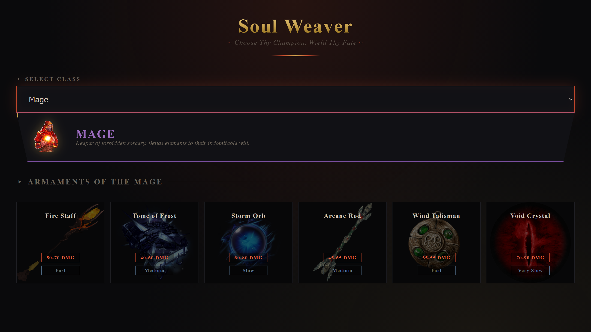

# ⚔️ Soul Weaver — Character Arsenal

> A dark, Souls-like character weapon viewer — built with HTML, CSS (Flexbox), JavaScript, and React.

<div align="center">


</div>

---

## 🔗 Live Demo

**[👉 View Live Demo](https://Mamadinit1.github.io/Soul-Weaver/)**

---

## 📸 Preview

<div align="center">
  
</div>

---

## ✨ Features

- ⚔️ Select a class — Warrior, Mage, Assassin, Archer, or Healer
- 🗡️ View weapons — each class reveals their unique legendary armaments
- 🎨 Dynamic styling — each class has its own color, accent, and visual identity
- 🖤 Souls-like theme — dark palette, ember glow, and gothic-inspired UI
- 🏰 Immersive atmosphere — floating icons, hover effects, and golden gradients
- 📱 Fully responsive — a consistent experience across mobile, tablet, and desktop

---

## 🛠️ Tech Stack

| Technology        | Purpose                                     |
| ----------------- | ------------------------------------------- |
| HTML5             | Semantic page structure                     |
| CSS3 (Flexbox)    | Fully responsive layout, Souls-like styling |
| JavaScript (ES6+) | App logic, DOM manipulation                 |
| React 18          | Component architecture, state management    |
| Vite              | Fast bundler for development                |

---

## 🚀 Getting Started
```
git clone https://github.com/Mamadinit1/Soul-Weaver.git
cd Soul-Weaver
```

Install dependencies and start the dev server:

npm install
npm run dev

Then open the local address shown in your terminal (usually http://localhost:5173).

---

## 📁 Project Structure
```
Soul-Weaver/
├── public/
│ └── images/
│ ├── warrior.png
│ ├── mage.png
│ ├── assassin.png
│ ├── archer.png
│ ├── healer.png
│ └── weapons/
│ ├── LongswordOfAsh.png
│ ├── BerserkerAxe.png
│ ├── TwinMace.png
│ ├── PiercingSpear.png
│ ├── BulwarkBlade.png
│ ├── WarHammer.png
│ ├── FireStaff.png
│ ├── TomeOfFrost.png
│ ├── StormOrb.png
│ ├── ArcaneRod.png
│ ├── WindTalisman.png
│ ├── VoidCrystal.png
│ ├── VenomDagger.png
│ ├── ShadowKatana.png
│ ├── ShurikenRing.png
│ ├── HiddenClaws.png
│ ├── PoisonBow.png
│ ├── UmbralBlade.png
│ ├── Longbow.png
│ ├── HeavyCrossbow.png
│ ├── CompositeBow.png
│ ├── SerpentArrow.png
│ ├── FlameArrow.png
│ ├── ElvenBow.png
│ ├── HealingStaff.png
│ ├── PrayerBook.png
│ ├── SacredBell.png
│ ├── NatureWand.png
│ ├── LightOrb.png
│ └── GuardianStaff.png
├── src/
│ ├── assets/
│ ├── components/
│ │ ├── Header/
│ │ │ ├── Header.jsx
│ │ │ └── header.css
│ │ └── Main/
│ │ ├── Main.jsx
│ │ ├── main.css
│ │ ├── SelectClass.jsx
│ │ └── Weapons.jsx
│ ├── styles/
│ │ └── app.css
│ └── App.jsx
├── index.html
├── package.json
├── vite.config.js
└── README.md
```
---

## 🧠 React Concepts Used

| Concept               | Where                                      |
| --------------------- | ------------------------------------------ |
| useState              | Managing selected class state              |
| Derived State         | Computing classCharacter from targetClass  |
| Lifting State Up      | State in Main.jsx, passed down to children |
| Conditional Rendering | Empty state vs class info + weapons grid   |
| Controlled Components | Select box with value + onChange           |
| Dynamic Styling       | Inline styles based on class color/accent  |
| Props Drilling        | Passing components                         |

---

## 🎯 About This Project

This project was built as a React learning exercise focused on:

- Dependent UI that updates based on user selection
- Dynamic rendering
- Immutable data patterns
- Component composition and separation of concerns
- Dark fantasy / Souls-like UI design

---

## 📝 License

This project is free to use, learn from, and build upon.

---

<div align="center">
  Built with ⚔️ + 🔥 for the love of dark fantasy
</div>
